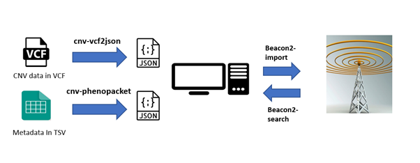

<!--

The paper.md, bibtex and figure file can be found in this repo:

  https://github.com/journal-of-research-objects/Example-BioHackrXiv-Paper

To modify, please clone the repo. You can generate PDF of the paper by
pasting above link (or yours) in

  http://biohackrxiv.genenetwork.org/

-->

# Introduction

Copy number variants (CNV) are genetic insertions or deletion mutations that lead to creating repeats in the sequence of the affected genome. 
The repeats are varied between species and individuals from the same species [1]. Studying those variations helps in understanding the development 
of certain diseases. Also helps in providing more information about population diversity and studying the interaction between the host and the microbiome. 
Over the past years, much research has been done to find CNV in humans and study their effects. It led to the production of many collections 
of open and private CNV datasets. Having those datasets in a format that allows searching for the area of interest CNV can help the researchers 
interested in studying the structural effect of CNV in specific genomic positions. 

Beacon is a protocol developed by The Global Alliance for Genomics and Health ([GA4GH](https://www.ga4gh.org/)) to simplify the connection between the researchers and the genomic data providers. 
The first Beacon data access API was designed to query the genomic data collection to check the presence or the absence of specific genetic mutation. 
Later, the yes or no Beacon approach was developed in version 2 to provide more information about the genomic data and perform more complex queries. This allows 
clinicians to retrieve the phenotypic data, metadata, and disease-associated data from the Beacon database collections. The Beacon database is hosted on MongoDB, 
a document-oriented database. The users can create many collections with many documents for the same database. The [MongoDB](https://www.mongodb.com/) is flexible in terms of the datasets 
which can be hosted. They can be in various forms, formats, and schema documents. MongoDB provides a flexible method to interact with. Depending on the user's preference, 
they can use Java [2] or Python ([PyMongo](https://pymongo.readthedocs.io/en/stable/index.html)) [3] scripts to interact with MongoDB. 

[Galaxy](https://usegalaxy.org/) is a web platform that hosts a diverse collection of Bioinformatics tools that can be used directly on the platform without installation, 
infrastructure requirements or coding skills. The Galaxy community are contributing around the hour to integrate more tools and training materials 
in different research areas such as biology, molecular biology, chemistry, and finance. Galaxy also provides the ability to create and reuse analytical Workflows 
(pipelines made of many tools for a specific analysis). The Galaxy workflow is used to save time in reproducing the same analysis..  

In this project, we will develop tools to help create a Beacon database for CNVs datasets obtained from the 1000 Human Genome (HG) project and wrap those tools into Galaxy. 
The tools will cover the steps required for creating the beacon database, from the data and metadata pre-processing step, which converts them into the beacon-accepted format, 
to import the data into the Beacon and query them.

### Project goals

For the BioHackathon 2023, we set a number of multifaceted goals:

- Develop Python tools to preprocess the 1000HG structural variant datastes into beacon format and interact with the Beacon MongoDB
- wrap the developed tools on Galaxy to share them with the community
- Create a Workflow pipeline to preprocess the data and upload them into Beacon
- Design a training material to guide the potential beacon providers on how they can create their BEacon data, process the data, import the data into the Beacon and query it

# Results

## Tools description 

We developed four tools to help build the Beacon database for the 1000HG CNV datasets and interact with it (Figure 1). 
The cnv-vcf2json and cnv-phenopacket tools extract the data from the input datasets and follow the Beacon schema to convert 
them from their original formats (VCF and TSV) into JSON format. The Beacon2-import tool uploads the data as a collection into 
the Beacon server. The Beacon2-search parses the beacon collection to find the datasets that match the search parameters.  

### Extract the Phenopacket metadata using cnv-Phenopacket

<!--
    State the problem you worked on
    Give the state-of-the art/plan
    Describe what you have done/results starting with The working group created...
    Write a conclusion
    Write up any future work
-->

The GA4GH developed a standard schema for sharing the phenotypic data, including the phenotypic features [4],
and the individual’s observable traits such as the signs, symptoms, and disease type [5]. Those features are 
used by researchers and clinicians for computational analysis to build data biobanks and databases and use phenotypic 
information to help in diagnosing and searching for various health cases like cancer and other diseases [4]. 
 
We followed the GA4GH Biosample schema [6] to develop the cnv-phenopacket Python tool. The tool extracts the phenotypic features
from the 1000HG input metadata file and uses the GA4GH Biosample schema to build the phenotypic output file (Figure 2) from the input metadata tab separated value (TSV) file.

I NEED BETTER FIGURE AND BETTER DISCTIPTION

### Convert the data into Beacon frindly format using cnv-vcf2json 

<!--
    State the problem you worked on
    Give the state-of-the art/plan
    Describe what you have done/results starting with The working group created...
    Write a conclusion
    Write up any future work
-->

To query the genomic variants using the Beacon2 protocol, we developed the cnv-vcf2json python tool to convert the data from the
raw VCF format into Beacon quarriable format (JSON). The tools follow a configured schema to extract the CNV-related information 
from the 1000HG structural variants file into an output JSON file.

I NEED BETTER FIGURE AND BETTER DISCTIPTION AND FOLLOW THE STEPS ABOVE

###  Upload the data into Beacone MondoDB using Beacon2-import

<!--
    State the problem you worked on
    Give the state-of-the art/plan
    Describe what you have done/results starting with The working group created...
    Write a conclusion
    Write up any future work

* Remote member Nada Amin, Chris Mungall, Deepak Unni, Will Byrd

-->

MongoDB provides a fixable method to upload the data into the Beacon Database. PyMongo is one of the packages that use Python to interact with MongoDB. 
We developed a tool that uses PyMongo to import the Beacon formatted JSON structural variant files from the local environment or Galaxy history and 
import it into the specified of choice MongoDB Beacon. The tool connects to the MongoDB using the server port and host address. The user chooses the 
desired database and collection name he wants to create on MongoDB.

###  Search the Beacon MongoDB using Beacon2-search

<!--
    State the problem you worked on
    Give the state-of-the art/plan
    Describe what you have done/results starting with The working group created...
    Write a conclusion
    Write up any future work

* Remote member Nada Amin, Chris Mungall, Deepak Unni, Will Byrd

-->

The Beacon protocol purpose is to provide support to researchers and clinicians to query the genomic variants datasets hosted on a Beacon server. 
The search tool queries the Beacon database specific collection to find the datasets that match the search parameters.  There are four queries’ modes 
for the search tool taken from the GA4GH instructions. Sequence Queries, Range Queries, GeneId Queries and Bracket Queries.

Future work includes:

1. 
2. 
3. 

# Discussion

# References

Zhang, F., et al., Copy number variation in human health, disease, and evolution. Annual review of genomics and human genetics, 2009. 10: p. 451-481.
Wei-Ping, Z., L. Ming-Xin, and C. Huan. Using MongoDB to implement textbook management system instead of MySQL. in 2011 IEEE 3rd International Conference on Communication Software and Networks. 2011. IEEE.
O'higgins, N., MongoDB and Python: Patterns and processes for the popular document-oriented database. 2011: " O'Reilly Media, Inc.".
Jacobsen, J.O., et al., The GA4GH Phenopacket schema: A computable representation of clinical data for precision medicine. medRxiv, 2021: p. 2021.11. 27.21266944.
Jacobsen, J.O., et al., The GA4GH Phenopacket schema defines a computable representation of clinical data. Nature biotechnology, 2022. 40(6): p. 817-820.
Ladewig, M.S., et al., GA4GH phenopackets: A practical introduction. Advanced Genetics, 2023. 4(1): p. 2200016.

